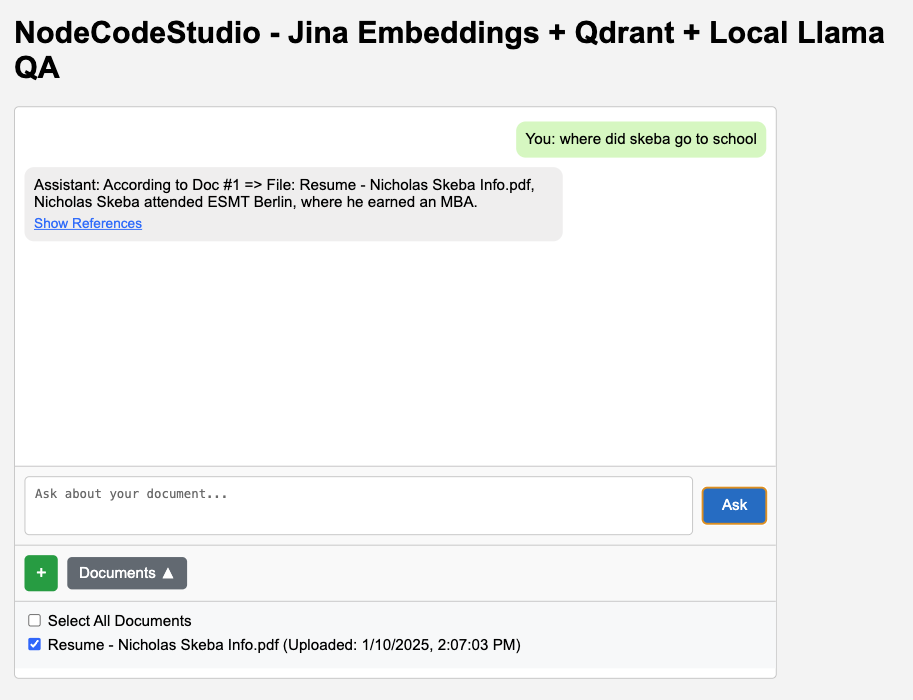

# NodeCodeStudio - Jina Embeddings + Qdrant + Local Llama QA

This is an interactive web-based application designed to:
- Upload, process, and manage document files (e.g., PDFs and text files).
- Embed document data using Jina embeddings.
- Store and query embeddings via Qdrant for efficient retrieval.
- Answer user queries based on document context using a locally hosted Llama model.

The application leverages PHP backend endpoints and JavaScript for front-end functionality. This README provides a guide for setting up and using the application.

---

## Features
- **Document Management**: Upload and manage multiple documents.
- **Search**: Query document content based on user questions.
- **Local LLM Integration**: Use a local Llama model to generate context-aware responses.
- **Document Chunking**: Split documents into manageable parts for embedding.
- **Reference Modal**: View references for assistant responses.
- **File Previews**: Display previews for uploaded files.

---

## Setup Instructions

### Prerequisites
- A web server capable of running PHP.
- Qdrant for vector storage and retrieval.
- A local Llama model endpoint for QA (optional).

### Installation
Clone the repository:
   ```bash
1.   git clone https://github.com/yourusername/NodeCodeStudio.git
2. Set up your web server to serve the `index.html` file.

3. Deploy the PHP backend endpoints on your server. These include:
   - `list_documents.php`
   - `upload_chunks.php`
   - `embeddings.php`
   - `search_chunks.php`

4. Ensure Qdrant is running and accessible for storing and querying vector embeddings.

5. *(Optional)* Set up your local Llama model endpoint and ensure it’s accessible.